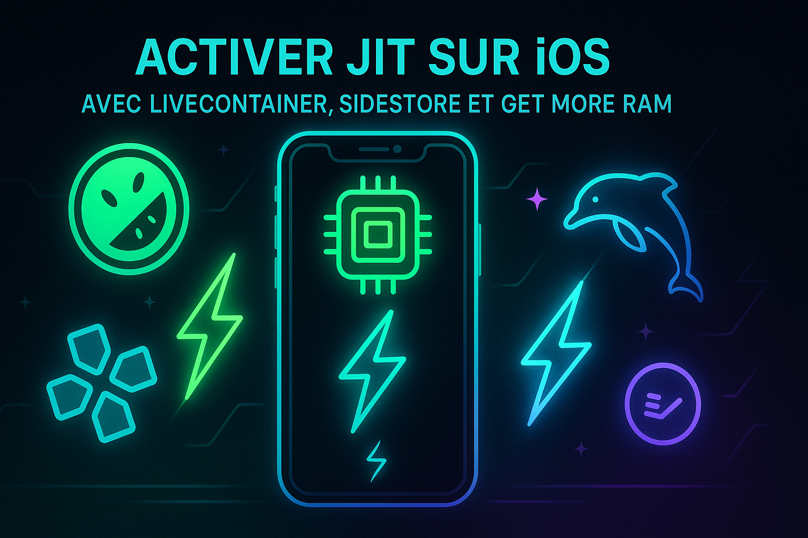

# livecontainer-jit-setup
# 🧠 Activer JIT iOS dans LiveContainer (sans patch, sans slot perdu)

Astuce ultime pour activer la mémoire étendue (JIT) dans un LiveContainer iOS, sans modifier l’app, sans perdre de slot SideStore, et même hors ligne après activation.

---

## 🎯 Objectif

Activer JIT sur des émulateurs iOS (MelonX, PPSSPP, DolphiniOS, etc.) **sans signer chaque app** ni multiplier les LiveContainer.

---

## 🛠️ Pré-requis

- ✅ SideStore installé avec un LiveContainer propre (non modifié)
- 📦 IPA de ton émulateur
- 🧪 IPA de **Get More RAM**
- ⚙️ **Stikdebeug** installé (pour activer JIT une fois)
- 🔓 Avoir déjà activé JIT une fois via Stikdebeug (autorisation système)

---

## 🔧 Méthode (pas à pas)

### 1. Installe un LiveContainer “propre”
> Un seul suffit. Pas de patch, pas d’entitlements modifiés.

---

### 2. Ouvre le LiveContainer et installe :
- Ton émulateur
- Get More RAM

---

### 3. Dans LiveContainer :
- Ouvre **Get More RAM**
- Active la mémoire étendue (JIT)

---

### 4. Dans SideStore :
- 🔁 Décoche temporairement LiveContainer
- ✅ Réactive-le juste après

---

### 5. Lance ton émulateur depuis LiveContainer :
> ✅ Le JIT est activé automatiquement 🎉

---

## ✅ Avantages

- 🆓 Aucun slot SideStore utilisé pour les émulateurs
- 🧘‍♂️ Pas besoin de signer chaque émulateur individuellement
- 🚫 Aucun patch ou entitlements modifiés
- ⚡ JIT stable et rapide via Get More RAM
- 📴 Fonctionne **hors ligne** après activation
- 🧠 Astuce simple, propre et scalable

---

## 📌 Conclusion

Tu crées **un seul LiveContainer centralisé**, tu y actives la mémoire étendue via Get More RAM, et tous les émulateurs internes profitent du JIT.  
> ✅ Résultat : propre, stable, efficace.

---

## 🔗 Ressources utiles
- [SideStore]https://sidestore.io)
- [Get More RAM]https://github.com/hugeBlack/GetMoreRam/releases/download/nightly/Entitlement.ipa)
- [Stikdebeug]https://apps.apple.com/fr/app/stikdebug)
